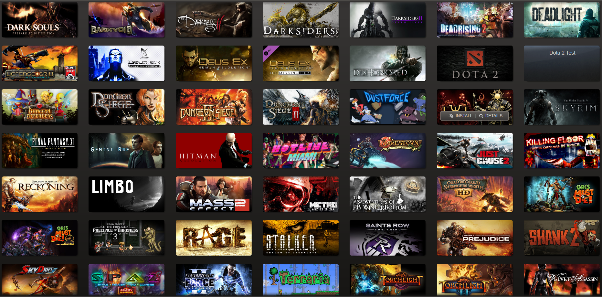
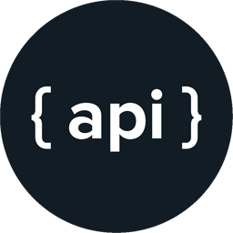

# VG Collector  Website

# **Project 3**

> *Game Collector Goals*
* `Create a mySql or MongoDB data structure that stores user’s collection stats.`
* `Use igdb api (https://www.igdb.com/api) to compare, and update users collection.`
* `Create an easy to navigate UI to enrich user experience.`
---
_Overview_

`Build a website that allows users to sign up, save, manage and update their video game collection.`

---
> **`Stretch Goals`**
_Use steamworks api to automatically add to users collection_

  
* `(note: not every user might use steam)` 

---

> ## **Tools and Technology used to achieve our goals:**

 >             

---

 ## Team Members:
 ---
 *Design and layout*
 > Sergio Burca aka Serg.io
 
  > Maxwell Robb
 ---
 *Client side logic*
 > Jeffrey Easley aka Easy E 
 ---
 *BackEnd*
 > Andrew Knowles aka Andy Boi
 
 > Devin Dinapoli aka Dr. DEV-in
